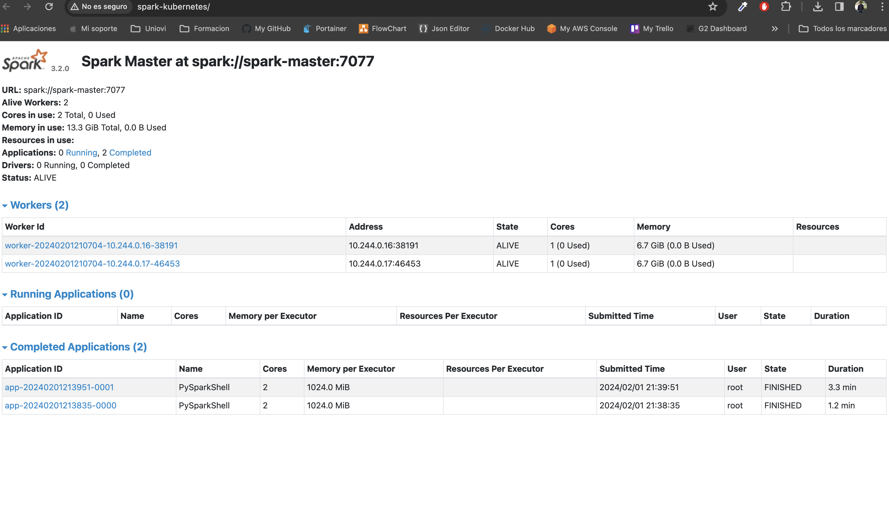

# Deploying Spark on Kubernetes

## Want to learn how to build this?

Check out the [post](https://testdriven.io/deploying-spark-on-kubernetes).

## Want to use this project?

### Minikube Setup

Install and run [Minikube](https://kubernetes.io/docs/setup/minikube/):

1. Install a  [Hypervisor](https://kubernetes.io/docs/tasks/tools/install-minikube/#install-a-hypervisor) (like [VirtualBox](https://www.virtualbox.org/wiki/Downloads) or [HyperKit](https://github.com/moby/hyperkit)) to manage virtual machines
1. Install and Set Up [kubectl](https://kubernetes.io/docs/tasks/tools/install-kubectl/) to deploy and manage apps on Kubernetes
1. Install [Minikube](https://github.com/kubernetes/minikube/releases)

Start the cluster:

```sh
$ minikube start --memory 8192 --cpus 4
$ minikube dashboard
```

Build the Docker image. **Please read the mac patched chapter before build the spark image**.
The eval command set the docker context to bind to docker minikube context, to publish the image
inside minikube directly

```sh
$ eval $(minikube docker-env)
$ docker build -f docker/Dockerfile -t spark-hadoop:3.2.0 ./docker
```

Create the deployments and services:

```sh
$ kubectl create -f ./kubernetes/spark-master-deployment.yaml
$ kubectl create -f ./kubernetes/spark-master-service.yaml
$ kubectl create -f ./kubernetes/spark-worker-deployment.yaml
$ minikube addons enable ingress
$ kubectl apply -f ./kubernetes/minikube-ingress.yaml
```

Add an entry to /etc/hosts. **Please read the mac patched chapter before modify hosts file**.

```sh
$ echo "$(minikube ip) spark-kubernetes" | sudo tee -a /etc/hosts
```
### Install spark inside Mac M1

In **Mac with minikube** installed, you must execute this command and create a tunnel like this

We must patch the original Dockerfile

```
#ADD common.sh spark-master spark-worker /
COPY common.sh spark-master spark-worker /
RUN chmod +x /common.sh /spark-master /spark-worker
```

we must add this entrance in the hosts file to create a static dns resolution
from 127.0.0.1 to spark-kubernetes dns controlled by the ingress controller inside kubernetes
Also we must create a tunnel from localhost to minikube cluster after it.

```sh
$ echo "127.0.0.1 spark-kubernetes" | sudo tee -a /etc/hosts

$ minikube tunnel
```

Now open the uri from your browser using the static dns spark-kubernetes created before:

```sh
http://spark-kubernetes
```



Test it out in the browser at [http://spark-kubernetes/](http://spark-kubernetes/).
